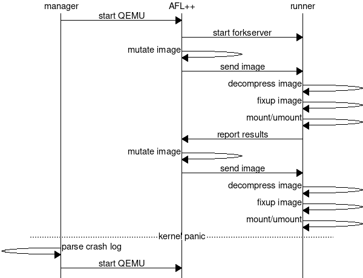

# Architecture notes

`btrfs-fuzz` runs tests in a VM so we can detect and respond to kernel panics.
`harness` is responsible for managing the VM and responding appropriately to
panics.  `AFL++` generates and mutates btrfs images. `runner` runs/tests each
generated image inside the VM. All tests are run in the same process for better
fuzzing performance. This is ok b/c btrfs has minimal shared state between
mounts.  `runner` is also responsible for collecting kernel code coverage and
writing the results to a shared memory buffer that AFL++ reads. FS images are
also compressed to improve speed. Image fixups after decompression are
necessary to get deeper code path penetration (so the code doesn't bail early
when it sees a mismatched checksum or an invalid superblock magic).

### Diagram

The following diagram shows two test case executions: one uninteresting
execution and one panic.

